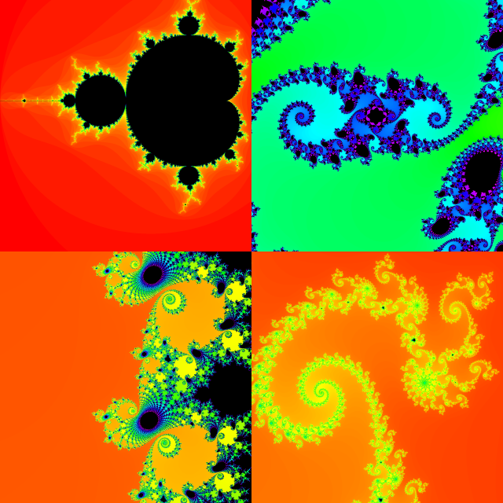

# fractalviewer
A Fractal viewer implemented in JavaScript for running in the web browser.

[Directly open it](https://n3xus6.github.io/fractalviewer/fract_viewer.html)

### Screenshots

### Running it locally

The app performs the more heavy calculations within a Web Worker thread.\
It's possible to execute it outside a Web Server but that requires to lower the security settings.\
This is dangerous. So never ever forget to reset the following settings before continue with surfing. 

- Firefox: under `about:config` set `security.fileuri.strict_origin_policy` to `false`.

- Chrome: close all Chrome windows before then start Chrome with the option `--allow-file-access-from-files`.

## Fractals and Chaos

*"Very simple dynamical systems that depend on only one variable can behave just as unpredictably, just as turbulently as the weather or the stock market."* (Dr. Robert Devaney)

### Mandelbrot Set

The study of Mandelbrot set began 1985.

Definition of the Mandelbrot set:

Set of complex numbers `c` for which `f(z) = z^2 + c` does not diverge when iterated from `z = 0`, i.e., for which the sequence `f(0), f(f(0)), etc.`, remains bounded in absolute value.

Alternative definiton:

Set of values of `c` in the complex plane for which the orbit of the critical point `z = 0` under iteration of the quadratic map `z_n+1 = z_n^2 + c` remains bounded.

A point `c` belongs to the Manelbrot set if and only if `|z_n|<=2` for all `n>=0`. If the absolute value exceeds 2, the sequence will escape to infinity.

The definition of the Mandelbrot set is credited to Adrien Douady who named it in tribute to Benoit Mandelbrot.

The intersection of the Manelbrot set with the real axis is precisely the interval `[-2, 1/4]`.

The Mandelbrot set is quasi-self-similar. Small slightly different versions of itself can be found at arbitrarily small scales.

The Boundary of the Mandelbrot set is a fractal curve. The **Hausdroff dimension** of the boundary of the Mandelbrot set equals 2.

If `c` is held constand and `z` is varied instead, one obtains the corresponding **Julia Set** for the point `c`.

([Wikipedia](https://en.wikipedia.org/wiki/Mandelbrot_set))

## Resources

[Video lecture on YouTube: Chaos, Fractals and Dynamics: Computer Experiments in Mathematics, Robert L. Devaney](https://www.youtube.com/watch?v=TVfn6P4Z4-8)
